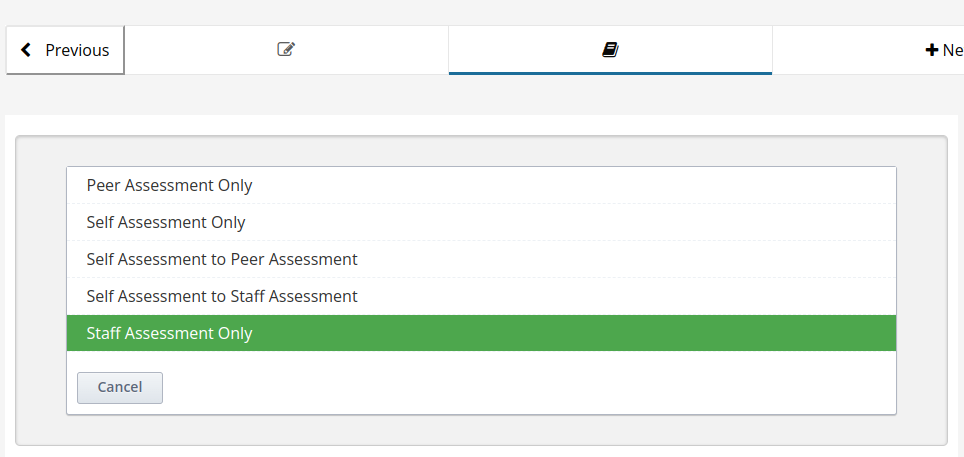

# Tạo funix ora

Funix ora: 
- Chỉ có 1 prompt là optional: là 1 ô textarea để học viên điền vào nội dung: có muốn reviewer chú ý phàn nào trong bài nộp không. Phần này có thể bỏ trống. 
- Bắt buộc và chỉ được nộp 1 file .zip. 
- Là **Staff Assessment Only**.

Các bước tạo: 

B1: Tạo component Open Response. Mỗi Unit chỉ được có duy nhất 1 component Open Response. .
B2: Chọn Staff Assessment Only. 
B3: Chọn Edit. 
B4: Sửa nội dung: 

- Tab Prompt: không làm gì. 
- Tab Schedule: sửa deadline mong muốn. 
- Tab Assessment Step: không làm gì. 
- Tab Rubric: 
    + Một criterion chỉ được có 2 option: Failed: 0 điểm và Passed: 5 điểm. 
    + Mỗi criterion nên được set Feedback for This Criterion là Required. Optional hoặc None cũng không sao, nhưng nếu vậy sau khi chấm, nội dung nhận xét cho Criterion đó sẽ trống, nhìn kỳ và có vẻ hời hợt với học viên. 
- Tab Settings, các mục cần chú ý: 
    + Estimated Time: số phút dự kiến hoàn thành bài assignment, chỉ có mục đích hiển thị. Nên set để mục đích hiển thị. 
    + Text Response: là nọi dung học viên note muốn reviewer chú ý phần nào trong bài nộp, phải là Optional. 
    + File Uploads Response: phải là Required. 
    + Allow Multiple Files: phải là False.
    + File Upload Types: phải là Custom File Types
    + File Type: `zip`.

.

=> Save.
