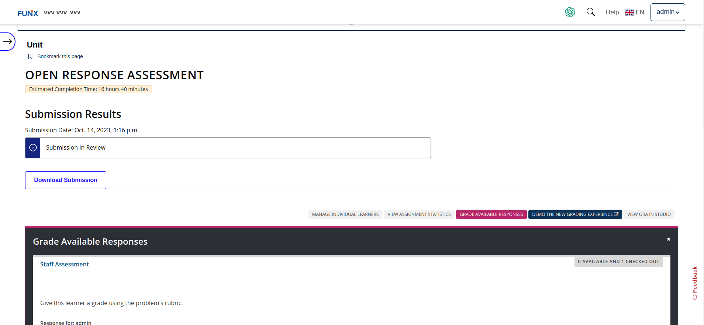
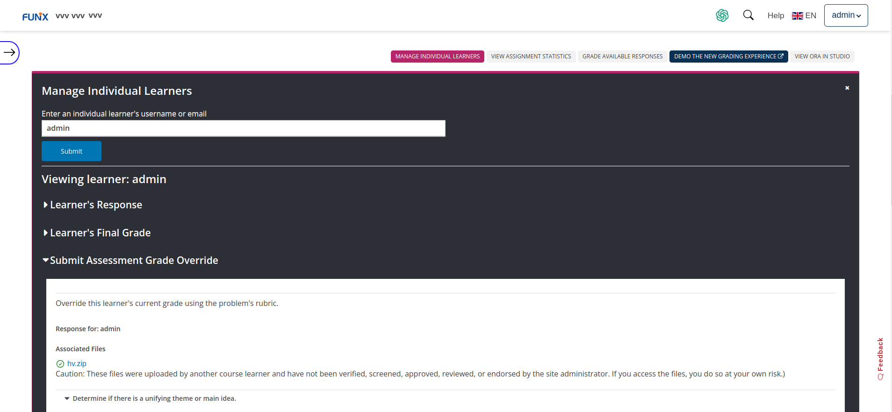
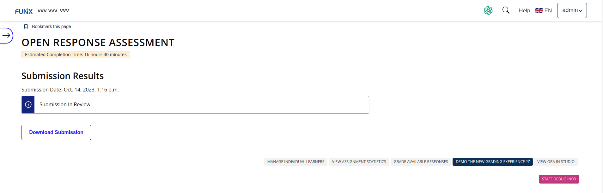
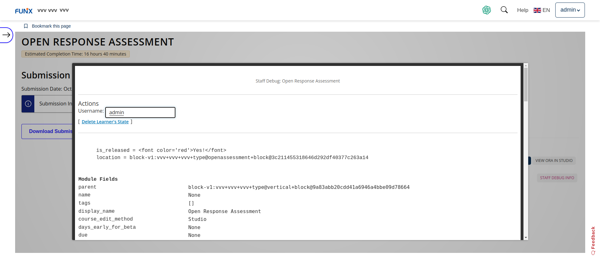

# Chấm bài ora funix

### Chấm bài lần 1

Tại Unit có bài assignment ora: 

C1: Chọn Grade Available Responses > Staff Assessment > Chấm bài. 

C2: Chọn Manage individual leaners > nhập username hoặc email > Enter > Submit Assessment Grade Override > Chấm bài. 

### Chấm lại bài

Dùng cách 2 ở trên. 

### Cho phép học viên nộp bài lại khi bài nộp không đạt

Tại Unit có bài assignment ora > Staff Debug Info > Nhập username > Delete Learner's State.

