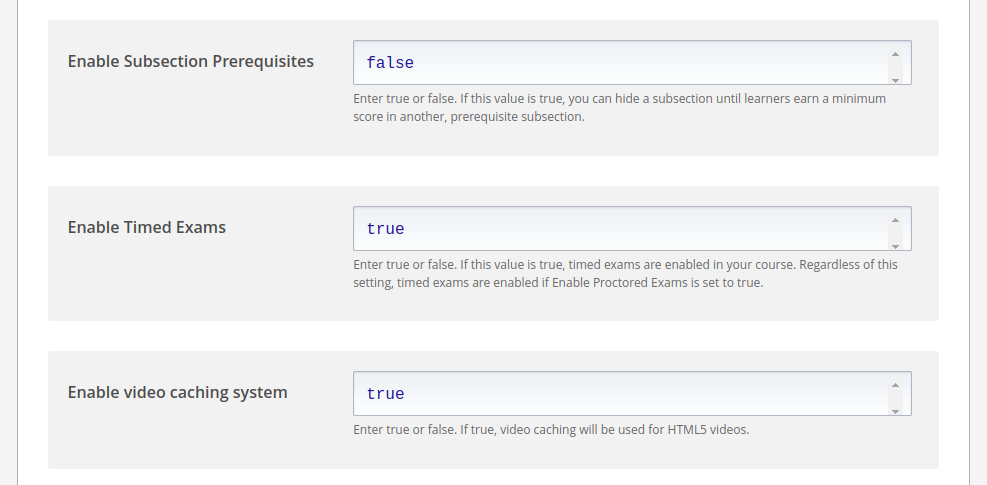
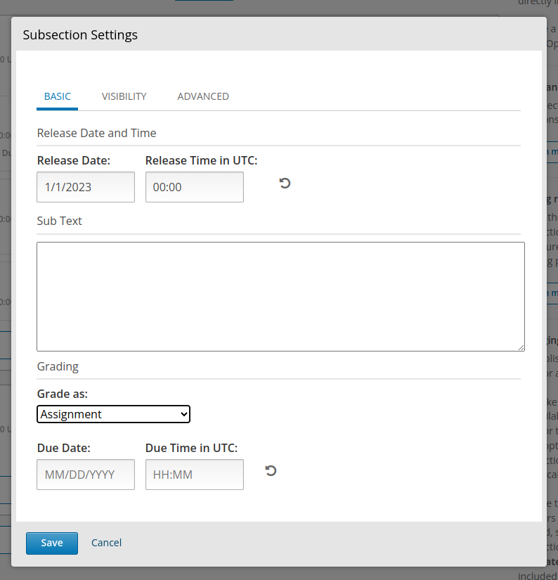
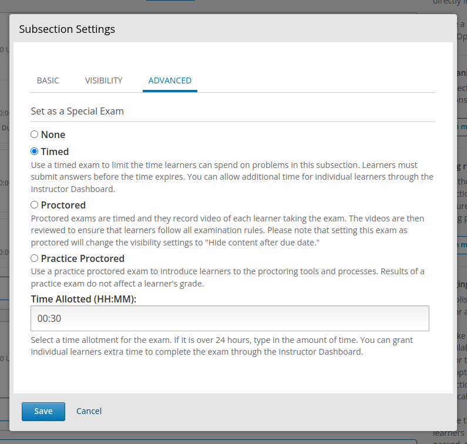

# enable time exam

---

## Developer

**Ở devstack `lms.yml` và `studio.yml`, set:**

```yml
FEATURES:
    ENABLE_SPECIAL_EXAMS: true
```
**Ở Tutor**

**C1:** set ở `config.yml`: chưa tìm ra cách. 

**C2:** set `cms.env.yml` và `lms.env.yml` ở `"$(tutor config printroot)"/env/apps/openedx/config`:

```yml
FEATURES:
    ENABLE_SPECIAL_EXAMS: true
```

Có điều khi set trực tiếp ở 2 file này, mõi lần `tutor config save` thì sẽ bị mất > phải set tay lại.

**C3:** dùng plugins

Nội dung file plugin ở [đây](https://gist.github.com/uuuuv/b5cd8a391d886eb7908686ba5f622852)

Tạo folder plugin và cd tới đó: 
```shell
mkdir -p $(tutor plugins printroot)
cd $(tutor plugins printroot)
```

Tạo file `enable-timed-exam.py` với nội dung theo link trên. 

Kiểm tra xem plugin đã được nhận chưa: 
```shell
tutor plugins list
```

Enable Plugin: 
```shell
tutor plugins enable enable-timed-exam
```

Restart tutor: 
```shell
tutor local stop && tutor local start -d
```

---

## Course team

1. Enable timed exam: Ở studio tại course cần tạo timed exam: Settings > Advaned Settings > Enable timed exam, đặt giá trị là `true`. 
2. Tại subsection cần tạo timed exam. Click hình bánh răng cưa. Modal hiện lên. 
3. Chọn Grade as "Assignment" hoặc gì đó để tinh điểm. 
4. Ở thẻ Advanced, chọn Timed, và chọn thời gian giới hạn. 


